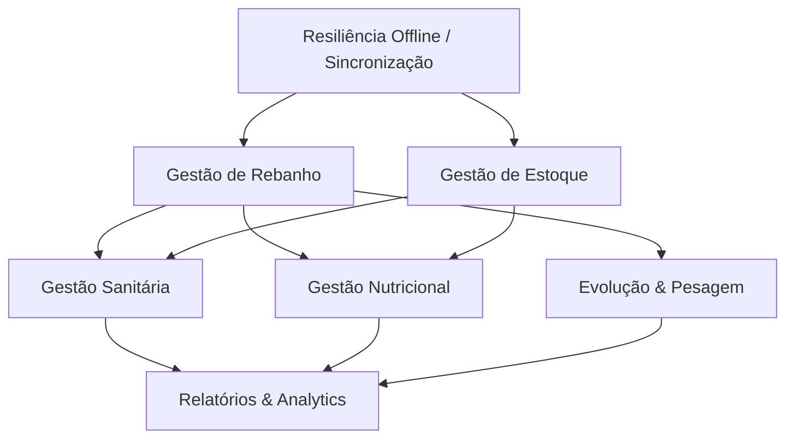

# FASE 03 — Capability Discovery

## 1. Capability Map
*Mapa consolidado do que o sistema precisa ser capaz de fazer.*

### 1.1. Gestão de Rebanho
- Cadastrar, visualizar e editar Fazendas, Piquetes e Lotes.
- Cadastrar, visualizar e editar Animais individualmente, vinculando-os a lotes.

### 1.2. Gestão Sanitária
- Registrar aplicação de vacinas e medicamentos (em lotes ou indivíduos).
- Calcular fim de carência automaticamente com base na regra do produto.
- Bloquear/alertar visualmente operações com animais em período de carência.
- Anexar fotos e registrar ocorrências sanitárias (doenças, óbitos).

### 1.3. Gestão Nutricional
- Cadastrar dietas vinculadas a categorias ou lotes.
- Registrar o fornecimento diário no campo.
- Comparar a quantidade planejada vs. fornecida e gerar alerta de divergência (ex: >15%).

### 1.4. Gestão de Estoque
- Cadastrar e manter o saldo de produtos (ração, suplemento, vacinas, medicamentos).
- Efetuar baixa automática de insumos a partir de lançamentos sanitários e nutricionais.
- Notificar o usuário sobre estoque abaixo do mínimo e proximidade do vencimento.

### 1.5. Evolução Zootécnica & Financeiro
- Registrar pesagens individuais ou por lote e calcular GMD (Ganho Médio Diário).
- Lançar e dar baixa em contas a pagar e receber simples (Financeiro).

### 1.6. Resiliência de Dados (Sync)
- Registrar eventos localmente sem bloqueio em modo offline.
- Acumular eventos em fila de sincronização (*outbox*).
- Transmitir eventos em lote e lidar com indisponibilidade momentânea de rede (idempotência).
- Gerenciar conflitos quando a versão local divergir da versão do servidor.

## 2. Capability Ownership
*Responsabilidades sobre o uso e integridade das capacidades.*

| Papel | Capacidades Sob Sua Responsabilidade |
|-------|---------------------------------------|
| **Colaborador / Peão** | Gestão Sanitária (Execução), Gestão Nutricional (Fornecimento), Evolução (Pesagem). O foco é *input* rápido de dados. |
| **Gerente / Proprietário** | Gestão de Rebanho (Cadastros estruturais), Gestão de Estoque, Nutrição (Formulação), Resolução de Conflitos de Sincronização, Financeiro, Relatórios. O foco é *gestão e auditoria*. |

## 3. Capability Dependencies
*Grafo de precedência para a construção e operação do sistema.*

*Leitura: A ponta da seta indica a capacidade que DEPENDERÁ da capacidade de origem. Ou seja, sem Resiliência Offline e Estoque, não existe Gestão Sanitária.*
